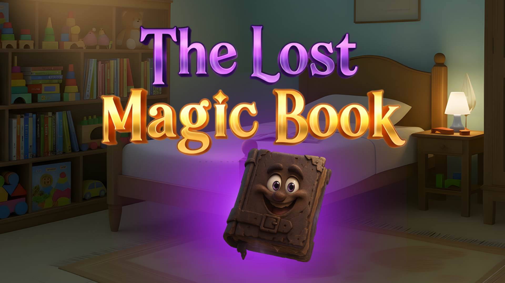

# 📖 Flipbook Template (turn.js based)

A reusable flipbook scaffold extracted from "The Lost Magic Book". Single-page
landscape layout, video / image / inline-HTML page support, preloader, and a
left-edge tap-to-go-back zone.

---

## Dependencies

```html
<!-- jQuery (required by turn.js) -->
<script src="https://code.jquery.com/jquery-3.6.0.min.js"></script>

<!-- turn.js – download from https://github.com/blasten/turn.js -->
<script src="./turn.min.js"></script>
```

---

## `index.html`

```html
<!DOCTYPE html>
<html lang="en">
<head>
  <meta charset="UTF-8">
  <meta name="viewport" content="width=device-width, initial-scale=1">
  <title>My Storybook</title>
  <link rel="stylesheet" href="./flipbook.css">
</head>
<body>

  <!-- 1. Preloader (shown until assets are warm) -->
  <div id="preloader">
    <div class="loader-stage">
      <div class="loader-book">
        
      </div>
      <div class="loader-overlay">
        <div class="loader-bar-wrap"><div class="loader-bar" id="loaderBar"></div></div>
        <button id="startBtn" style="display:none;" onclick="startApp()">▶ Start</button>
      </div>
    </div>
  </div>

  <!-- 2. Book scene -->
  <div class="book-scene">
    <div class="book-cover-wrap">
      <div class="flipbook-viewport" style="position:relative">
        <div class="container">
          <div id="flipbook" dir="ltr"><!-- pages injected by JS --></div>
        </div>
        <!-- Optional: text/bubble overlay above all pages -->
        <div id="storyOverlay"></div>
        <!-- Tap zone for previous-page (left edge) -->
        <div class="book-spine"></div>
      </div>
    </div>
    <div class="pg-cnt" id="pgCnt">My Storybook</div>
  </div>

  <script src="https://code.jquery.com/jquery-3.6.0.min.js"></script>
  <script src="./turn.min.js"></script>
  <script src="./flipbook.js"></script>
</body>
</html>
```

---

## `flipbook.css`

```css
/* Reset + body */
*,*::before,*::after { margin:0; padding:0; box-sizing:border-box; }
html, body {
  width:100vw; height:100vh;
  overflow:hidden;
  background:linear-gradient(135deg, #3a0f6e 0%, #1a0640 100%);
  font-family:-apple-system, system-ui, sans-serif;
}

/* ─────────────────────────────────────────────
   Preloader
   ───────────────────────────────────────────── */
#preloader {
  position:fixed; inset:0; z-index:99999;
  background:#0e0a1e;
  display:flex; align-items:center; justify-content:center;
  transition:opacity .6s ease;
}
#preloader.hide { opacity:0; pointer-events:none; }
.loader-stage { text-align:center; }
.loader-book { margin-bottom:18px; }
.loader-cover-img { width:240px; height:auto; }
.loader-bar-wrap {
  width:240px; height:6px;
  background:rgba(255,255,255,.18);
  border-radius:6px; overflow:hidden; margin:0 auto;
}
.loader-bar {
  height:100%; width:0%;
  background:linear-gradient(90deg, #e0c8ff, #ffffff);
  box-shadow:0 0 10px rgba(224,200,255,.85);
  transition:width .3s ease;
}
#startBtn {
  margin-top:14px;
  padding:10px 30px;
  background:#ffffff;
  border:none; border-radius:50px;
  font-size:16px; font-weight:700;
  color:#3a0f6e; cursor:pointer;
  box-shadow:0 6px 18px rgba(0,0,0,.35);
}

/* ─────────────────────────────────────────────
   Book scene
   ───────────────────────────────────────────── */
.book-scene {
  position:absolute; top:53%; left:50%;
  display:flex; flex-direction:column; align-items:center;
  transform:translate(-50%, -50%);
}
.book-cover-wrap {
  position:relative;
  background:#5e18a8;        /* book cover colour */
  padding:14px;
  border-radius:18px;
  filter:
    drop-shadow(0 20px 40px rgba(0,0,0,.38))
    drop-shadow(0 6px 14px rgba(0,0,0,.22));
}
.book-cover-wrap::before {
  content:''; position:absolute; inset:0;
  pointer-events:none;
  background:linear-gradient(to bottom,
    rgba(255,255,255,.07) 0%,
    transparent 35%,
    rgba(0,0,0,.06) 100%);
  border-radius:inherit;
}

/* Flipbook viewport (single-page landscape) */
.flipbook-viewport {
  width:820px; height:472px;
  overflow:hidden; position:relative;
  touch-action:none;
  -webkit-user-select:none; user-select:none;
}
.book-scene,
.book-scene *,
.flipbook-viewport,
.flipbook-viewport * {
  -webkit-user-select:none; user-select:none;
  -webkit-tap-highlight-color:transparent;
  -webkit-touch-callout:none;
}
.book-scene img,
.flipbook-viewport img {
  -webkit-user-drag:none;
}
.flipbook-viewport .container {
  position:absolute; top:50%; left:50%;
}
#flipbook {
  width:820px; height:472px;
  position:relative;
  left:-410px; top:-236px;
}

/* Page styles */
.flipbook-viewport .page {
  width:820px; height:472px;
  background-color:#fff;
  background-repeat:no-repeat;
  background-size:100% 100%;
  border-radius:4px 10px 10px 4px;
  overflow:hidden;
}
.flipbook-viewport .page::before {
  /* Subtle paper-curve shadow on the right edge */
  content:''; position:absolute; inset:0;
  pointer-events:none; border-radius:inherit;
  box-shadow:
    inset -14px 0 22px -14px rgba(0,0,0,.22),
    inset 6px 0 12px -8px rgba(0,0,0,.10);
  z-index:50;
}
.flipbook-viewport .turn-page-wrapper .page {
  background-color:#fff;
}
.flipbook-viewport .shadow {
  transition:box-shadow .5s;
  box-shadow:0 0 20px #bbb;
}

/* Left-edge invisible tap zone for previous-page */
.book-spine {
  position:absolute;
  left:0; top:0; bottom:0;
  width:40px;
  z-index:10;
  cursor:pointer;
}

/* Page counter / title below the book */
.pg-cnt {
  margin-top:14px;
  color:#ffffff;
  font-size:13px;
  letter-spacing:1px;
  opacity:.7;
}

/* Pointer-event passthrough: in-page videos/iframes
   would otherwise eat turn.js's corner-peel drag. */
.flipbook-viewport .spread-video,
.flipbook-viewport iframe.spread-html {
  pointer-events:none;
}
```

---

## `flipbook.js`

```js
$(document).ready(function(){

  /* ─────────────────────────────────────────
     1. Page content config — your story data
     ───────────────────────────────────────── */
  var STORY = {
    title: "My Storybook",
    pages: [
      { image: 'page1.png' },
      { image: 'page2.png' },
      { video: 'page3.mp4' },          // page can be video instead
      { image: 'page4.png' },
      { html: '<h1>Inline HTML</h1>' } // or inline HTML
      // …add more pages here
    ]
  };

  /* ─────────────────────────────────────────
     2. Build the flipbook pages
     ───────────────────────────────────────── */
  var W = 820, H = 472;
  var $fb = $('#flipbook');

  // Dummy first page (turn.js needs an even page count to bind covers)
  $fb.append('<div class="page dummy-page"></div>');

  STORY.pages.forEach(function(page, i){
    var $p = $('<div class="page"></div>').attr('data-si', i);

    if(page.video){
      var $vid = $(document.createElement('video'))
        .attr({ playsinline:'', preload:'auto', muted:true })
        .css({ width:W+'px', height:H+'px', objectFit:'cover',
               position:'absolute', top:0, left:0 })
        .addClass('spread-video');
      $vid[0].src = page.video;
      $p.css({ position:'relative', overflow:'hidden' }).append($vid);
    } else if(page.image){
      $p.append('');
    } else if(page.html){
      $p.html('<div style="width:100%;height:100%;overflow:hidden;background:#fff;">'+page.html+'</div>');
    }

    $fb.append($p);
  });

  // Dummy last page
  $fb.append('<div class="page dummy-page"></div>');

  /* ─────────────────────────────────────────
     3. Initialize turn.js
     ───────────────────────────────────────── */
  $fb.turn({
    width: W,
    height: H,
    autoCenter: true,
    elevation: 50,
    gradients: true,
    duration: 1000,                 // page-turn animation duration (ms)
    acceleration: true,
    display: 'single',              // 'single' or 'double'
    when: {
      turning: function(e, page, view){
        // Prevent going back from the first content page (data-si="0" = page 2)
        if(page < 2 && $fb.turn('page') === 2){
          e.preventDefault();
        }
      },
      turned: function(e, page){
        $('#pgCnt').text('Page ' + (page - 1) + ' / ' + STORY.pages.length);
        playPageVideo(page);
        pauseOtherVideos(page);
      }
    }
  });

  /* Start on the first content page (skip dummy) */
  $fb.turn('page', 2);

  /* ─────────────────────────────────────────
     4. Interactions
     ───────────────────────────────────────── */

  // Left-edge tap → previous page
  $('.book-spine').on('pointerdown', function(e){
    e.preventDefault();
    $fb.turn('previous');
  });

  // Arrow keys
  $(document).keydown(function(e){
    if(e.key === 'ArrowRight') $fb.turn('next');
    if(e.key === 'ArrowLeft')  $fb.turn('previous');
  });

  /* ─────────────────────────────────────────
     5. Helpers for video pages
     ───────────────────────────────────────── */
  function playPageVideo(turnPage){
    var si = turnPage - 2;
    var vid = $('#flipbook .page[data-si="'+si+'"] video').get(0);
    if(vid){
      vid.muted = false;
      vid.currentTime = 0;
      vid.play().catch(function(){});
    }
  }
  function pauseOtherVideos(turnPage){
    var currentSi = turnPage - 2;
    $('#flipbook video').each(function(){
      var si = parseInt($(this).closest('.page').attr('data-si'), 10);
      if(si !== currentSi){ this.pause(); this.currentTime = 0; }
    });
  }

  /* ─────────────────────────────────────────
     6. Preloader → Start button → fade in book
     ───────────────────────────────────────── */
  preloadAssets(function(){
    document.getElementById('startBtn').style.display = 'inline-block';
  });

  function preloadAssets(done){
    var assets = [];
    STORY.pages.forEach(function(p){
      if(p.image) assets.push(p.image);
      if(p.video) assets.push(p.video);
    });
    var loaded = 0;
    var bar = document.getElementById('loaderBar');
    if(assets.length === 0){ done(); return; }
    assets.forEach(function(url){
      var isVideo = /\.(mp4|webm|mov)(\?|$)/i.test(url);
      if(isVideo){
        fetch(url).then(function(r){ return r.blob(); }).then(complete).catch(complete);
      } else {
        var img = new Image();
        img.onload = img.onerror = complete;
        img.src = url;
      }
    });
    function complete(){
      loaded++;
      var pct = Math.round((loaded/assets.length)*100);
      if(bar) bar.style.width = pct + '%';
      if(loaded === assets.length) done();
    }
  }
});

/* Called when Start button is clicked */
function startApp(){
  var pl = document.getElementById('preloader');
  if(pl){
    pl.classList.add('hide');
    setTimeout(function(){ pl.style.display = 'none'; }, 600);
  }
  // Kick off first page's video
  setTimeout(function(){
    var firstVid = document.querySelector('#flipbook .page[data-si="0"] video');
    if(firstVid){
      firstVid.muted = false;
      firstVid.play().catch(function(){});
    }
  }, 500);
}
```

---

## File structure

```
your-project/
├── index.html
├── flipbook.css
├── flipbook.js
├── turn.min.js          ← download from blasten/turn.js
├── cover.png            ← preloader cover image
├── page1.png            ← page contents
├── page2.png
├── page3.mp4
└── …
```

---

## Customisation knobs

| What | Where |
|---|---|
| Cover colour | `flipbook.css` → `.book-cover-wrap { background: }` |
| Page size | Change `W` and `H` in `flipbook.js`; sync the same values in `.flipbook-viewport`, `#flipbook`, `.page` in CSS |
| Page-turn animation duration | `$fb.turn({ duration: 1000 })` |
| Single vs double-page spread | `$fb.turn({ display: 'single' \| 'double' })` |
| Disable back-turn from cover | `when: { turning: e.preventDefault() }` block |
| Add tap-anywhere advance | Add `$('#flipbook').on('click', () => $fb.turn('next'))` |

---

## Notes / gotchas from the source project

- **Single-page landscape** layout was chosen so each page is a full-width
  landscape frame (good for video).
- **`.book-spine`** is an invisible 40-px zone on the left edge that lets
  users tap to go back, separate from turn.js's right-edge corner peel.
- **Pointer-events `none` on videos/iframes** is critical — without it,
  those elements eat the corner-peel drag and the flipbook feels broken.
- **`data-si` attribute** tracks "story index" so you can find a specific
  page's video later. turn.js's own page numbering is 1-based and offset
  by your dummy pages, so `data-si = turnPage - 2`.
- **Preloader cache trick:** use `fetch().blob()` for videos (warms HTTP
  cache) and `new Image()` for images (warms image cache via the same
  request path the `` will use later) — important for cache-hit
  consistency, otherwise images may pop-in on first display.
- **Audio note** — on mobile (iOS/Chrome Android), audio playback is
  blocked until a user gesture. The Start button click is the gesture
  that unlocks `<video>` audio for the rest of the session. If you don't
  have a Start button, you'll need another tap-to-unlock pattern.

---

## What's NOT included

This template is the flipbook *scaffold only*. Things from the source
project that you'd add per-project:

- Page-specific overlays (text bubbles, click hotspots, animated decorations)
- Background music (a `<audio loop>` + play/pause on Start)
- Replay-page button
- Themed background per page (CSS variables driven by `data-si`)
- Per-page voiceovers
- Any game / interactive content that lives on top of the flipbook

Drop those in as needed for your specific storybook.
